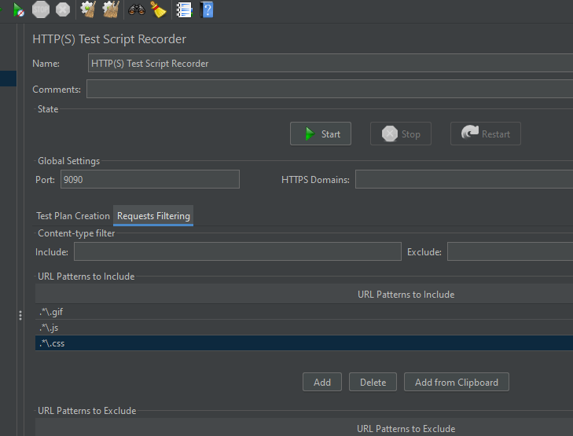

# Lesson 3: Configuring and Using the Proxy Server

## Goal
The goal of this lesson is to configure the Proxy Server in JMeter and demonstrate how to use it for recording HTTP(S) requests.

## Steps

### 3.1. Configuring the Proxy Server
1. **Setting Port and URL Patterns**
    - In the **HTTP(S) Test Script Recorder** window, set the **Port** field to `9090`.
    - In the **URL Patterns to Exclude** section, click **Add** and enter patterns such as `.*\.gif`, `.*\.js`, and `.*\.css`.
       
### 3.2. Starting the Proxy Server
1. **Starting Recording**
    - Click the **Start** button at the bottom of the **HTTP(S) Test Script Recorder** window.
       
---

# [Next: Recording and Managing HTTP Requests](recording-and-managing-http-requests.md)
