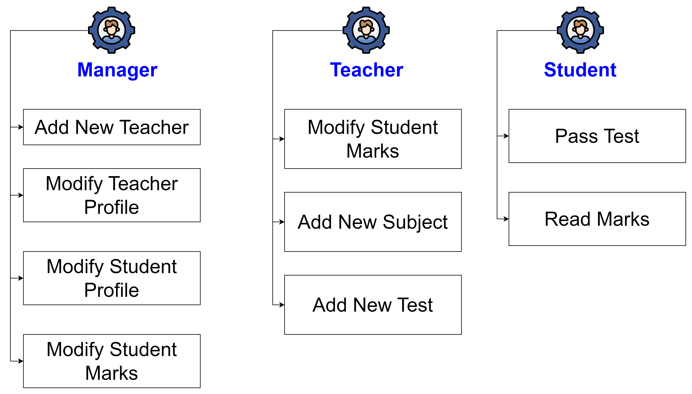

# Spring Security 实验任务

欢迎来到 Spring Security 实验任务系列！本系列任务旨在帮助您实践并熟悉 Spring Security，从而建立一个足够的启动项目。无论您是初学者还是希望提升技能，这些动手任务将引导您完成在 Spring 应用中集成安全性的各个方面。

## 实验任务的目标

本实验任务的主要目标是让您在 Spring 环境中使用安全性获得实际经验和熟练程度。Spring Security 广泛用于身份验证、授权和保护项目，通过这些任务，您将深入了解其配置、身份验证、授权等方面。

## 练习任务 

1. [任务 1：配置 Spring Security](practice/configure-spring-security.md)
2. [任务 2：创建用户的基本实现](practice/base-implementation-user.md)
3. [任务 3：密码加密](practice/password-encryption.md)
4. [任务 4：添加虚拟用户](practice/add-dummy-users.md)
5. [任务 5：为用户创建身份](practice/create-identity-to-users.md)
6. [任务 6：在服务器中创建授权基础](practice/setup-server-authorization.md)
7. [任务 7：授权已认证用户](practice/authorize-server-authenticated.md)
8. [任务 8：按角色授权](practice/authorize-server-role.md)
9. [任务 9：按权限授权](practice/authorize-server-authority.md)
10. [任务 10：配置 Thymeleaf 安全性](practice/configure-thymeleaf-security.md)
11. [任务 11：授权已认证用户](practice/authorize-client-authenticated.md)
12. [任务 12：按角色授权](practice/authorize-client-role.md)
13. [任务 13：按权限授权](practice/authorize-client-authority.md)
14. [任务 14：自定义登录表单](practice/custom-login-form.md)

## 实验任务 

### 任务 1：设置 Spring Security
在项目中初始化 Spring Security。

### 任务 2：定义用户角色和权限
定义不同的用户角色（管理员、教师、学生）及其相应的权限。

### 任务 3：在控制器中配置安全性
使用基于角色的访问控制保护端点。

#### 实现细节
**管理员角色**：
- 添加新教师 (`/teachers/new`)
- 修改教师资料 (`/teachers/{id}/edit`)
- 修改学生资料 (`/students/{id}/edit`)
- 修改学生成绩 (`/students/{id}/marks/edit`)

**教师角色**：
- 修改学生成绩 (`/students/{id}/marks/edit`)
- 添加新科目 (`/subjects/new`)
- 添加新考试 (`/tests/new`)

**学生角色**：
- 参加考试 (`/tests/{id}/take`)
- 查看成绩 (`/students/{id}/marks`)

### 任务 4：在 Thymeleaf 模板中实现授权
基于用户角色限制对 UI 元素的访问。

### 任务 5：测试基于角色的访问控制
确保端点和 UI 元素受到正确保护。

