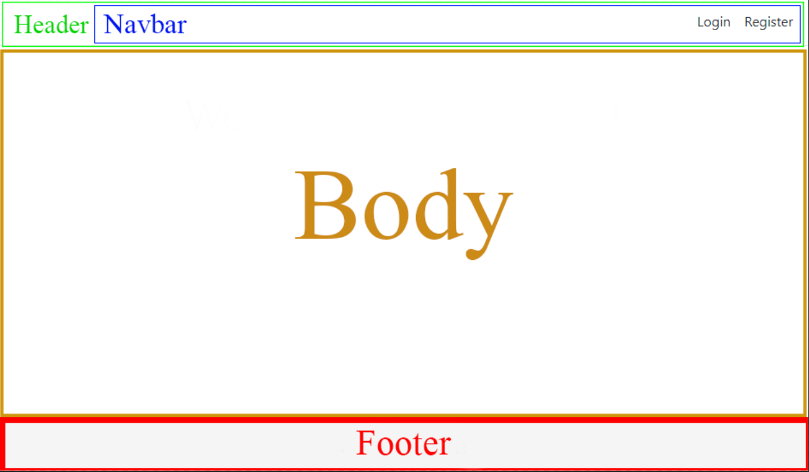
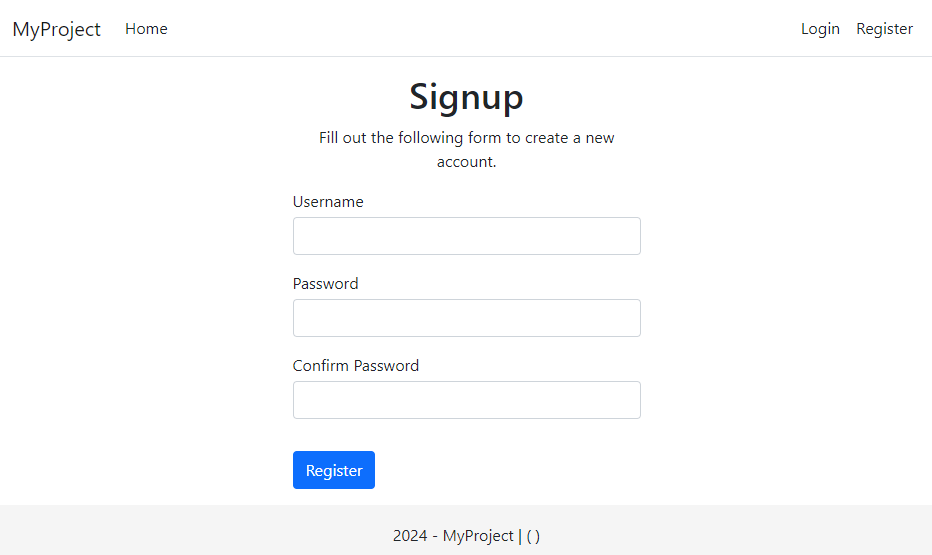
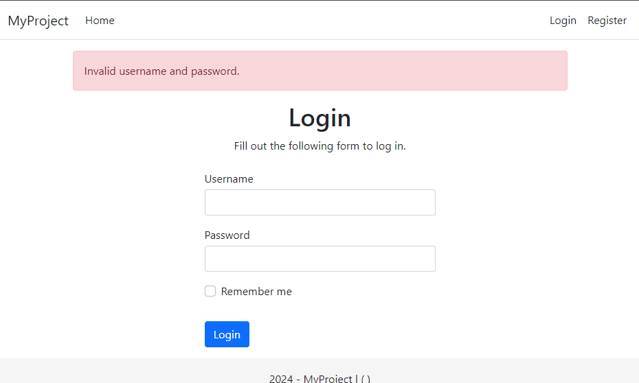
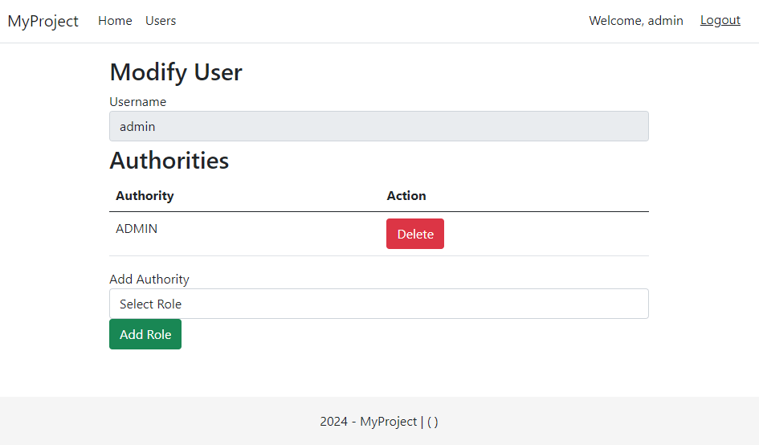

# Thymeleaf 实验任务

欢迎来到 Thymeleaf 实验任务系列！本系列任务旨在帮助您实践和掌握 Thymeleaf，这是一种强大的 Java 应用模板引擎。无论您是初学者还是希望提升技能，这些动手任务将引导您完成在 Spring 应用中集成 Thymeleaf 的各个方面。

## 实验任务的目标

本实验任务的主要目标是让您在 Spring 环境中使用 Thymeleaf 获得实际经验和熟练程度。Thymeleaf 广泛用于网页开发中的服务器端渲染，通过这些任务，您将深入了解其配置、变量使用、控制器、表单处理等方面。

## 练习任务 

1. [任务 1：在 Spring 中配置 Thymeleaf](practice/configure-thymeleaf.md)
2. [任务 2：创建第一个视图](practice/create-first-view.md)
3. [任务 3：处理变量](practice/working-with-variables.md)
4. [任务 4：变量与控制器](practice/variables-and-controller.md)
5. [任务 5：迭代](practice/iteration.md)
6. [任务 6：文本字面量](practice/literals.md)
7. [任务 7：表单](practice/forms.md)
8. [任务 8：表单处理](practice/form-handling.md)
9. [任务 9：查询参数和验证](practice/validation.md)
10. [任务 10：片段和布局](practice/fragments-and-layouts.md)

## 实验任务 

1. **任务 1：创建带片段的 HTML 布局**

   - 为 HTML 页面的不同部分创建单独的片段，如导航栏、头部、头部标签和页脚。
   - 将这些片段组合到一个 HTML 文件中形成完整的布局。
   - 例如：
     

2. **任务 2：创建带本地化的主页**

   - 实现一个可在路径 `/` 访问的主页。
   - 使用任务 1 中创建的布局来构建主页。
   - 使用 `#{}` 表达式处理主页内的所有文本内容，展示从文件.properties 文件中读取的本地化消息。
   - 例如：

   

3. **任务 3：创建登录和注册表单**

   - 设计并实现用户认证的登录和注册表单。
   - 使用 Thymeleaf 的模型绑定来处理表单数据。
   - 例如：

   

   

4. **任务 4：验证登录和注册操作**

   - 实现登录和注册操作的验证。
   - 使用查询参数传递验证失败的错误信息。
   - 确保用户输入的安全和正确处理。
   - 例如：

   

5. **任务 5：创建用户页面**

   - 开发一个显示用户表格的用户页面。
   - 实现迭代来动态填充用户数据表。
   - 提供从页面删除或修改用户条目的功能。
   - 例如：

   

   

请随时探索并按照自己的节奏完成这些任务。每个任务都旨在进一步提升您在 Thymeleaf 和网页开发方面的技能。如果您有任何问题或需要帮助，请随时联系。

祝您编程愉快！