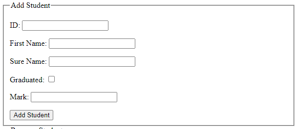

# 表单

**描述:**

在这个任务中，您将创建一个名为 `third.html` 的新的 Thymeleaf 视图，并在 `PracticeController` 中实现表单处理逻辑。该表单允许用户添加具有特定详细信息的新学生，控制器将处理表单提交。

**步骤:**

1. **创建第三个视图（third.html）:**

   - 在 `/src/main/resources/templates/practice` 目录中创建一个名为 `third.html` 的新的 Thymeleaf 视图文件。

     ```html
     <!DOCTYPE html>
     <html lang="en">
         <head>
             <meta charset="UTF-8">
             <title>添加学生表单</title>
         </head>
         <body>
             <fieldset>
                 <legend>添加学生</legend>
     
                 <form action="#" th:action="@{/addStudent}" th:object="${model}" method="post">
                     <!-- 表单字段 -->
                     <p>
                         <label for="id">ID:</label>
                         <input type="text" id="id" name="id" th:field="*{id}">
                     </p>
                 </form>
             </fieldset>
         </body>
     </html>
     ```

2. **配置表单提交:**

   - 在 `form` 标签中配置表单提交详情:

     ```html
     <form action="#" th:action="@{/addStudent}" th:object="${model}" method="post">
     ```

   - 解释:
      - `action="#"`: 此属性指定表单数据在提交时将发送到的 URL。`#` 表示表单将提交到其来源的相同 URL。
      - `th:action="@{/addStudent}"`: 这个 Thymeleaf 属性根据 Thymeleaf 表达式动态设置表单动作。`@{/addStudent}` 为 `/addStudent` 端点生成绝对 URL。
      - `th:object="${model}"`: 此属性将表单与后备对象（`model`）关联起来。Thymeleaf 使用此对象在表单提交和渲染过程中将表单字段绑定到属性。
      - `method="post"`: 此属性指定将表单数据发送到服务器时使用的 HTTP 方法。它设置为 `post`，表示表单数据将在请求体中发送。

3. **传递 'id' 字段:**

   - 在表单中，找到 `id` 字段的部分:

     ```html
     <!-- 表单字段 -->
     <p>
         <label for="id">ID:</label>
         <input type="text" id="id" name="id" th:field="*{id}">
     </p>
     ```

   - 解释:
      - `th:field="*{id}"`: 此 Thymeleaf 属性将输入字段绑定到 `model` 对象的 `id` 属性。它确保在表单提交时将输入字段中输入的值设置为 `id` 属性。
      - `id="id"` 和 `name="id"`: 这些属性为输入字段提供标识符。

4. **重复这些步骤:**

   - 对于每个剩余字段（`firstName`、`sureName`、`isGraduated` 和 `mark`），重复这些步骤。确保根据需要更新 `label`、`id`、`name` 和 `th:field` 属性。
   - 这里是代码示例:
    ```html
     <!DOCTYPE html>
     <html lang="en">
         <head>
             <meta charset="UTF-8">
             <title>添加学生表单</title>
         </head>
         <body>
             <fieldset>
                 <legend>添加学生</legend>
     
                 <form action="#" th:action="@{/addStudent}" th:object="${model}" method="post">
                     <!-- 表单字段 -->
                     <p>
                         <label for="id">ID:</label>
                         <input type="text" id="id" name="id" th:field="*{id}">
                     </p>
                     <p>
                         <label for="firstName">名字:</label>
                         <input type="text" id="firstName" name="firstName" th:field="*{firstName}">
                     </p>
                     <p>
                         <label for="sureName">姓氏:</label>
                         <input type="text" id="sureName" name="sureName" th:field="*{sureName}">
                     </p>
                     <p>
                         <label for="isGraduated">是否毕业:</label>
                         <input type="checkbox" id="isGraduated" name="isGraduated" th:checked="*{isGraduated}">
                     </p>
                     <p>
                         <label for="mark">分数:</label>
                         <input type="number" id="mark" name="mark" th:field="*{mark}">
                     </p>
                     <!-- 提交按钮 -->
                     <button type="submit">添加学生</button>
                 </form>
             </fieldset>
         </body>
     </html>
     ```

## 结果
您的视图应如下所示:



---

# [下一个任务: *表单处理*](form-handling.md)