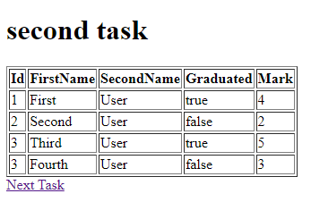

# 迭代

**描述:**

在这个任务中，您将通过在`models/`包中创建一个`StudentModel`类并在`PracticeController`中填充学生列表来探索Thymeleaf中的迭代概念。目标是将学生列表传递给`secondView`，并渲染显示学生详细信息的表格。

**步骤:**

1. **创建 StudentModel:**
   - 在 `models/` 包中创建一个 `StudentModel` 类，具有以下属性:

   ```java
   public class StudentModel {
       private Integer id = 0;
       private String firstName = "";
       private String sureName = "";
       private Boolean isGraduated = false;
       private Integer mark = 0;
   
       // Constructor, getters, and setters
   }
   ```

2. **在 PracticeController 中填充学生列表:**
   - 在 `PracticeController` 类中，创建一个 `StudentModel` 列表并用假的学生详情填充它:

   ```java
   @Controller
   public class PracticeController {
       private final List<StudentModel> students = new ArrayList<>();
   
       public PracticeController() {
           // Populate the list with users
           this.students.add(new StudentModel(1, "First", "User", true, 4));
           this.students.add(new StudentModel(2, "Second", "User", false, 2));
           this.students.add(new StudentModel(3, "Third", "User", true, 5));
           this.students.add(new StudentModel(4, "Fourth", "User", false, 3));
       }
   
       // Rest of the controller methods
   }
   ```

3. **将学生传递给 secondView:**
   - 在 `PracticeController` 的 `secondView` 方法中，将学生列表添加到模型中。

   ```java
   @Controller
   public class PracticeController {
       // Other methods...
   
       @GetMapping("/second")
       public String secondView(Model model) {
           // Pass the list of students to the view
           model.addAttribute("students", students);
           // Rest of the method...
       }
   }
   ```

4. **在 second.html 中渲染学生表:**
   - 打开 `second.html` Thymeleaf 视图文件。

5. **渲染表头:**
   - 在 `<thead>` 标签内添加表头部分:

   ```html
   <table border="1">
       <thead>
       <tr>
           <th>Id</th>
           <th>FirstName</th>
           <th>sureName</th>
           <th>Graduated</th>
           <th>Mark</th>
       </tr>
       </thead>
       <!-- Rest of the table... -->
   </table>
   ```

6. **使用迭代渲染表体:**
   - 在 `<tbody>` 标签内添加表体部分，并对学生列表进行迭代以渲染每一行:

   ```html
   <tbody>
       <!-- Iterate over the list of students and render each row -->
       <tr th:each="student : ${students}">
           <td th:text="${student.id}"></td>
           <td th:text="${student.firstName}"></td>
           <td th:text="${student.sureName}"></td>
           <td th:text="${student.isGraduated}"></td>
           <td th:text="${student.mark}"></td>
       </tr>
   </tbody>
   ```

## 结果
您的页面应如下所示:



---

# [下一个任务：*字面值*](literals.md)