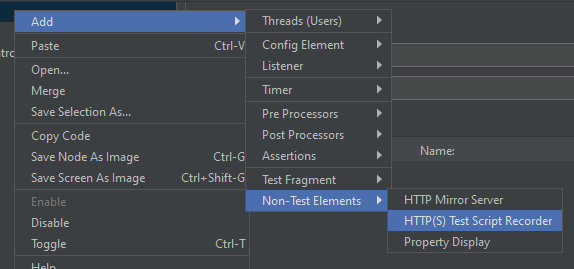

# Lesson 2: Setting Up HTTP(S) Test Script Recorder

## Goal
The goal of this lesson is to guide you through setting up the HTTP(S) Test Script Recorder in JMeter, including adding a Recording Controller and configuring a Proxy Server.

## Steps

### 2.1. Adding a Recording Controller
1. **Adding to Thread Group**
    - Right-click on the **Thread Group**.
       
   
    - Select **Add > Logic Controller > Recording Controller**.
       

### 2.2. Adding a Proxy Server
1. **Configuring Proxy**
    - Right-click on the **Workbench** node.
       
    - Select **Add > Non-Test Elements > HTTP(S) Test Script Recorder**.
       
---

# [Next: Configuring and Using the Proxy Server](configuring-and-using-the-proxy-server.md)
