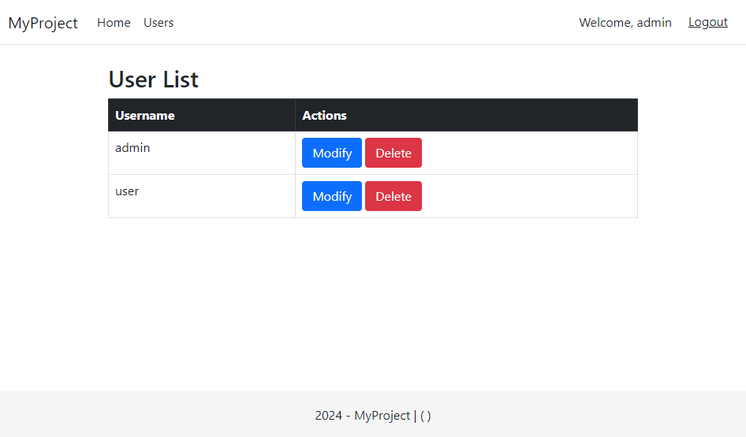

English | [中文](../../cn/thymeleaf/lab-work.md) | [Русский](../../ru/thymeleaf/lab-work.md)

# Thymeleaf Lab Work

Welcome to the Thymeleaf Lab Work! The goal of this series of tasks is to help you practice and master Thymeleaf, a powerful template engine for Java applications. Whether you're a beginner or looking to enhance your skills, these hands-on tasks will guide you through various aspects of Thymeleaf integration in a Spring application.

## Goal of the Lab Work

The primary goal of this lab work is to provide you with practical experience and proficiency in using Thymeleaf within a Spring environment. Thymeleaf is widely utilized for server-side rendering in web development, and through these tasks, you will gain valuable insights into its configuration, usage of variables, controllers, form handling, and more.

## Practice Tasks 

1. [Task 1: Configure Thymeleaf in Spring](practice/configure-thymeleaf.md)
2. [Task 2: Create First View](practice/create-first-view.md)
3. [Task 3: Working With Variables](practice/working-with-variables.md)
4. [Task 4: Variables and Controller](practice/variables-and-controller.md)
5. [Task 5: Iteration](practice/iteration.md)
6. [Task 6: Literals](practice/literals.md)
7. [Task 7: Forms](practice/forms.md)
8. [Task 8: Form Handling](practice/form-handling.md)
9. [Task 9: Query Parameter and Validation](practice/validation.md)
10. [Task 10: Fragments and Layouts](practice/fragments-and-layouts.md)

## Lab Work Tasks 

1. **Task 1: Create HTML Layout with Fragments**

    - Create individual fragments for different parts of an HTML page, such as navbar, header, head, and footer.
    - Assemble these fragments in a single HTML file to form a complete layout
    - For example:
    

2. **Task 2: Create Home Page with Localization**

    - Implement a home page accessible at the path `/`.
    - Utilize the layout created in Task 1 for structuring the home page.
    - Use `#{}` expressions for all text content within the home page, demonstrating localization or messages from a file.properties file.
    - For Example:
   
    

3. **Task 3: Create Login and Register Forms**

    - Design and implement login and register forms for user authentication.
    - Utilize Thymeleaf's model binding to handle form data.
    - For Example:
   
    

    

4. **Task 4: Validate Login and Register Actions**

    - Implement validation for login and register actions.
    - Use query parameters to pass error messages in case of validation failures.
    - Ensure secure and proper handling of user input.
    - For Example:
   
    

5. **Task 5: Create Users Page**

    - Develop a Users page that displays a table of users.
    - Implement iteration to dynamically populate the table with user data.
    - Provide functionality to delete or modify user entries from the page.
    - For Example:
   
    

    

