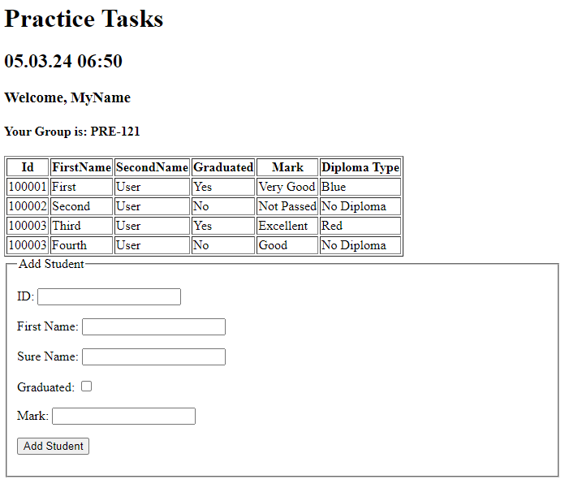

# Fragments and Layouts

**Description:**

In this section, we will implement Thymeleaf fragments and layouts. We'll update existing views to include fragments, and then create a new view that utilizes these fragments.

## **Steps:**

1. **Update `first.html` with a Fragment:**

    - Open the `first.html` file in the `practice` directory.
    - Add the `th:fragment` attribute to the `<div>` inside the `<body>` tag:

      ```html
      <!-- practice/first.html -->
      <html lang="en" xmlns:th="http://www.thymeleaf.org">
      <head>
          <!-- Other head elements... -->
      </head>
      <body>
          <!-- Updated: Add the 'th:fragment' attribute to the 'div' -->
          <div th:fragment="info">
              <p>This is the information section of the first view.</p>
          </div>
          <!-- Other content... -->
      </body>
      </html>
      ```

2. **Update `second.html` with a Fragment:**

    - Open the `second.html` file in the `practice` directory.
    - Add the `th:fragment` attribute to the `<table>` inside the `<body>` tag:

      ```html
      <!-- practice/second.html -->
      <html lang="en" xmlns:th="http://www.thymeleaf.org">
      <head>
          <!-- Other head elements... -->
      </head>
      <body>
          <!-- Updated: Add the 'th:fragment' attribute to the 'table' -->
          <table border="1" th:fragment="students-table">
              <thead>
              <tr>
                  <th>Id</th>
                  <th>FirstName</th>
                  <th>SecondName</th>
                  <th>Graduated</th>
                  <th>Mark</th>
                  <th>Diploma Type</th>
              </tr>
              </thead>
              <tbody>
              <!-- Student data will be inserted here -->
              </tbody>
          </table>
          <!-- Other content... -->
      </body>
      </html>
      ```

3. **Update `third.html` with a Fragment:**

    - Open the `third.html` file in the `practice` directory.
    - Add the `th:fragment` attribute to the `<fieldset>` inside the `<body>` tag:

      ```html
      <!-- practice/third.html -->
      <html lang="en" xmlns:th="http://www.thymeleaf.org">
      <head>
          <!-- Other head elements... -->
      </head>
      <body>
          <!-- Updated: Add the 'th:fragment' attribute to the 'fieldset' -->
          <fieldset th:fragment="add-student-form">
              <legend>Add Student</legend>
 
              <div th:if="${param.addedStudent}">
                  <p style="color: green;">Student Added Successfully!</p>
              </div>
 
              <form action="#" th:action="@{/addStudent}" th:object="${model}" method="post">
                 <!-- Other form elements... -->
              </form>
          </fieldset>
          <!-- Other content... -->
      </body>
      </html>
      ```

4. **Create `fourth.html` with Fragments Usage:**

    - Create a new file named `fourth.html` in the `practice` directory.
    - Use the `th:insert` and `th:replace` attributes to include the fragments from other views:

      ```html
      <!-- practice/fourth.html -->
      <html lang="en" xmlns:th="http://www.thymeleaf.org">
      <head>
          <!-- Other head elements... -->
      </head>
      <body>
          <!-- Updated: Insert the 'info' fragment from 'first.html' -->
          <div th:insert="~{practice/first :: info}"></div>
 
          <!-- Updated: Replace the 'students-table' fragment from 'second.html' -->
          <div th:replace="~{practice/second :: students-table}"></div>
 
          <!-- Updated: Insert the 'add-student-form' fragment from 'third.html' -->
          <div th:insert="~{practice/third :: add-student-form}"></div>
          <!-- Other content... -->
      </body>
      </html>
      ```

    - Explanation:
        - `th:insert` is used to include the content of the specified fragment (`info` and `add-student-form`) in the `fourth.html` file.
        - `th:replace` is used to replace the content of the specified fragment (`students-table`) in the `fourth.html` file.

## Result
Your view should look like that:



---

# Congratulations ! you completed all tasks. now let's move to **[Lab work tasks](../lab-work.md#lab-work-tasks)**