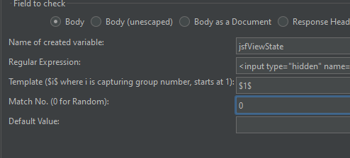

## Урок 7: Создание тестового сценария

### Цель
Цель этого урока - создать тестовый сценарий, организовав записанные запросы и добавив извлечение динамических значений в JMeter.

### Шаги

#### 7.1. Добавление простого контроллера
1. **Организация запросов**
   - Щелкните правой кнопкой мыши по **Группе потоков**.
      
   - Выберите **Добавить > Логический контроллер > Простой контроллер**.
      
   - Переименуйте Простой контроллер в соответствии с функцией, которую вы тестируете.
   - Перетащите все записанные HTTP-запросы из **Контроллера записи** в **Простой контроллер**.

#### 7.2. Добавление извлекателя регулярного выражения
1. **Извлечение динамического значения**
   - Щелкните правой кнопкой мыши на HTTP-запросе, который требует динамического значения (например, `javax.faces.ViewState`).
   - Выберите **Добавить > Постпроцессоры > Извлечение регулярного выражения**.
      
   - Настройте извлекатель:
      - **Имя ссылки:** `jsfViewState`
      - **Регулярное выражение:** `<input type="hidden" name="javax\.faces\.ViewState" value="(.*?)"`>
      - **Шаблон:** `$1$`
      - **Номер совпадения:** `0`
       

---

# [Далее: Параметризация HTTP-запросов](parameterizing-http-requests.md)