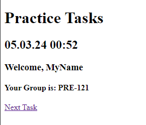

# Работа с переменными

**Описание:**

В этом задании вы исследуете и используете различные типы локальных переменных в Thymeleaf в представлениях вашего приложения Spring. К ним относятся переменные, определенные непосредственно в представлении, переменные, переданные из контроллера, переменные, определенные в файле свойств для локализации, и статические переменные, определенные в классе конфигурации Thymeleaf.

## **Шаги:**

1. **Определение локальных переменных в представлении Thymeleaf:**
    - Откройте файл представления Thymeleaf (например, `first.html`).
    - Изучите использование локальных переменных, определенных непосредственно в представлении.
    - В предоставленном примере кода:

       ```html
       <head th:with="title='Home'">
           <meta charset="UTF-8">
           <title th:text="${title}">Title</title>
       </head>
       ```

      Локальная переменная `title` определена внутри секции `<head>` HTML.

2. **Локализация переменных из файла свойств:**
    - Просмотрите конфигурацию бина `MessageSource` в вашем классе конфигурации Thymeleaf:

       ```java
       @Bean
       public MessageSource messageSource() {
           ReloadableResourceBundleMessageSource messageSource = new ReloadableResourceBundleMessageSource();
           messageSource.addBasenames("classpath:local/practice");
           messageSource.setDefaultEncoding("UTF-8");
 
           return messageSource;
       }
       ```
    - Создайте файл `practice.properties` в папке `/src/main/resources/local/` и добавьте следующее содержимое:

          ```properties
          student.name=MyName
          student.group=PRE-121
          message.welcome=Welcome, {0}
          message.info=Your Group is: {0}
          ```
   **Примечание о `{0}`:**
    - Обозначение `{0}` в локализационных сообщениях представляет собой заполнитель для переменной. Когда сообщение отображается, заполнитель `{0}` заменяется фактическим значением, предоставленным в сообщении. Например, в сообщении `Welcome, {0}`, `{0}` будет заменено значением переменной, таким как имя.

    - Изучите использование локализованных переменных в представлении Thymeleaf с использованием синтаксиса `#{}`.
    - В предоставленном примере кода:

       ```html
       <h3 th:utext="#{message.welcome(#{student.name})}"></h3>
       <h4 th:utext="#{message.info(#{student.group})}"></h4>
       ```

      Переменные `student.name`, `student.group`, `message.welcome` и `message.info` все реализуют эту идею.

3. **Статические переменные в классе конфигурации Thymeleaf:**
    - В своем классе конфигурации Thymeleaf добавьте статические переменные с использованием метода `addStaticVariable`:

       ```java
       @Bean
       public ViewResolver thymeleafViewResolver() {
           ThymeleafViewResolver resolver = new ThymeleafViewResolver();
           resolver.addStaticVariable("projectName", "Practice Tasks");
           resolver.addStaticVariable("currentDateTime", LocalDateTime.now());
           resolver.setTemplateEngine(templateEngine());
 
           return resolver;
       }
       ```

    - Получите доступ к этим статическим переменным в представлении Thymeleaf с использованием синтаксиса `#vars`.
    - В предоставленном примере кода:

       ```html
             <h1 th:utext="${#vars.projectName}">Project Name</h1>
             <h2 th:utext="${#temporals.format(#vars.currentDateTime, 'dd.MM.yy HH:mm')}">Current Date and Time</h2>
       ```

## Результат

теперь ваша страница должна выглядеть так:



---

# [СЛЕДУЮЩЕЕ ЗАДАНИЕ: *Переменные и контроллер*](variables-and-controller.md)
